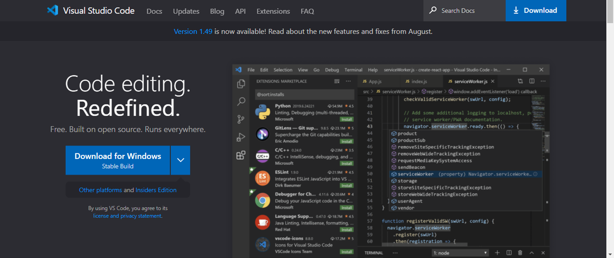

# 環境構築

１）Gitをインストール
https://gitforwindows.org/


２）GitHubに接続（下記を参照）
https://qiita.com/hollyhock0518/items/a3fee20951cd92c87ed9


３）python3.6.8をインストール
インストールフォルダの下記のファイルを実行
> install/python-3.6.8-amd64.exe

**インストール時は、パスを追加にチェックをいれる**


４）VsCodeをインストール  
https://eng-entrance.com/texteditor-vscode
  

５）レポジトリをダウンロード  
作業フォルダを作成して、下記のコマンドを実行
```
git clone https://github.com/banban-git/python.git
```

６）Visual Studioでpythonレポジトリを取り込む  
フォルダを開く　→ 5) でクローンしたレポジトリを選択


# ライブラリインストール
コマンドを全て実行し、ライブラリをインストールする。

```
pip install pylint
pip install requests
pip install webdriver_manager
pip install beautifulsoup4
pip install lxml
pip install openpyxl
pip install selenium
pip install PyMsgBox==1.0.7
pip install pyautogui
pip install youtube-dl
pip install google_images_download
pip install tensorflow==1.14
pip install numpy==1.16.4
pip install -U pyxel
pip install Flask
pip install dill
pip install janome
pip install opencv-python
pip install pyocr
pip install ImageHash

https://gammasoft.jp/blog/tesseract-ocr-install-on-windows/
```
# ■機械学習
作業フォルダ
> src/machine_learning
  

## ・画像取得
JPEGファイルを  
指定文字列『検索文字』で100件取得します。
```
python bing_scraper.py --search '炭治郎' --format 'jpg' --limit 20 --download --chromedriver chromedriver
```

## ・画像解析
学習回数＝1000回にしています。精度を上げたい場合は、  
--how_many_training_steps=**1000**　←ここの数字を変更してください
```
python retrain.py --bottleneck_dir=bottlenecks --how_many_training_steps=100 --model_dir=inception --summaries_dir=training_summaries/basic --output_graph=retrained_graph.pb --output_labels=retrained_labels.txt --image_dir=images
```
## ・実行
判別したい画像⇒ 『hanbetu1.jpg』
``` 
python label_image.py --graph=retrained_graph.pb --labels=retrained_labels.txt --output_layer=final_result --image=images_test/hanbetu1.jpg --input_layer=Placeholder
```


pyxeleditor raa
pyxeleditor raa

# setting.json(作業メモ)
変更前
```
"python.pythonPath": "\AppData\\Local\\Programs\\Python\\Python38-32\\python.exe",
```
変更後
```
"python.pythonPath": "C:\\Program Files\Python36\\python.exe",
```
